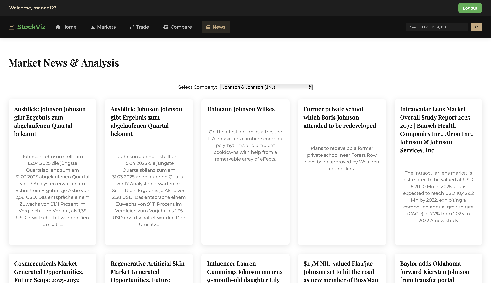
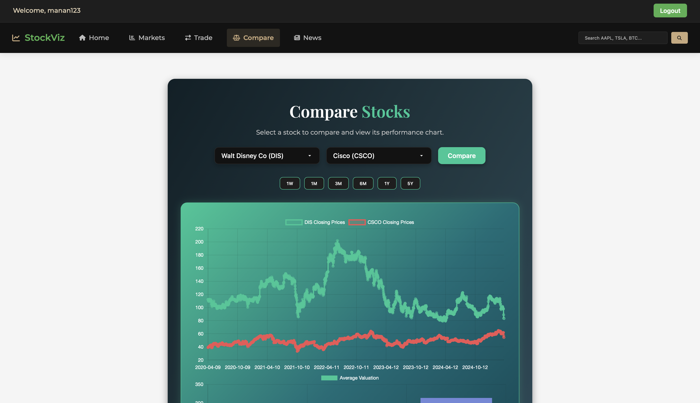
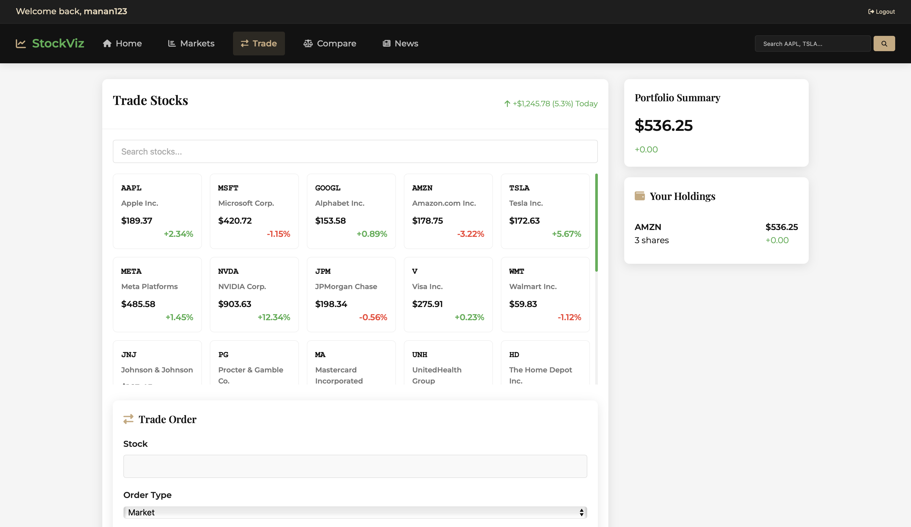

# StockViz: Market Analysis & Visualization Platform 📈


 <!-- Choose appropriate license -->

StockViz is a comprehensive platform designed to fetch, process, visualize, and display stock market and financial news data. It combines a Python backend for data handling with a dynamic web interface for user interaction and visualization.

## ✨ Features

*   **Stock Data Fetching:** Retrieves historical stock data (Open, High, Low, Close, Volume) using external APIs.
*   **News Data Aggregation:** Fetches relevant financial news articles for specified companies.
*   **Data Processing:** Cleans and transforms raw API data (including non-standard CSV/JSON formats) into structured Pandas DataFrames.
*   **Data Storage:** Saves processed stock and news data into organized CSV files.
*   **Backend Visualization:** Generates static charts (like line graphs and pie charts) using Python libraries.
*   **Web Interface:** A user-friendly website to:
    *   Display stock information and historical charts (using Chart.js).
    *   Show latest market news.
    *   Compare different stocks.
    *   (Potentially) Simulate trading and manage a virtual portfolio.

## 📸 Screenshots

*(Add screenshots of your application here)*

*Main Dashboard / Stock Chart:*


*News Section:*


*Stock Comparison:*


*Trading Interface:*


## 🛠️ Tech Stack

*   **Backend:**
    *   Python 3.x
    *   Pandas (Data manipulation and processing)
    *   Requests (For interacting with APIs - assumed)
*   **Frontend:**
    *   HTML5
    *   CSS3
    *   JavaScript
    *   Chart.js (Interactive charts)
*   **APIs:**
    *   Alpha Vantage (For stock data - inferred from `data_processor.py`)
    *   Newsdata.io (For news data - inferred from `newsdata_api.py`)
*   **Data Format:** JSON, CSV

## 📁 Project Structure

```
Sem-2-Project/
├── API/                  # Scripts for fetching data from external APIs
│   ├── stock_data.py
│   ├── news_data.py
│   └── newsdata.py
├── StockProcessing/      # Scripts for data processing and visualization
│   ├── data_processor.py
│   ├── newsdata_processor.py
│   ├── visualizer.py
│   ├── line_graph.py
│   └── pie_chart.py
├── website/              # Frontend web application
│   ├── assets/           # CSS, JS, Images
│   ├── *.html            # HTML pages (index, markets, trade, etc.)
├── stock-data-csv-files/ # Output directory for processed stock CSVs
├── news-data-csv-files/  # Output directory for processed news CSVs (if applicable)
├── main.py               # Main script to run the data pipeline
├── companies.json        # Configuration for company symbols/names
├── requirements.txt      # Python dependencies (You should create this)
└── README.md             # This file
```

## ⚙️ Setup and Installation

1.  **Clone the repository:**
    ```bash
    git clone <your-repository-url>
    cd Sem-2-Project
    ```

2.  **Set up a Python virtual environment (Recommended):**
    ```bash
    python3 -m venv .venv
    source .venv/bin/activate  # On Windows use `.venv\Scripts\activate`
    ```

3.  **Install Python dependencies:**
    *(First, create a `requirements.txt` file if you haven't)*
    ```bash
    pip install pandas requests # Add other libraries if needed
    pip freeze > requirements.txt # Create the file
    ```
    *Then install:*
    ```bash
    pip install -r requirements.txt
    ```

4.  **API Keys:**
    *   Sign up for API keys from [Alpha Vantage](https://www.alphavantage.co/) and [Newsdata.io](https://newsdata.io/).
    *   Store your API keys securely. You might need to:
        *   Modify the API scripts (`API/*.py`) to read keys from environment variables or a configuration file (recommended).
        *   **Do not commit your API keys directly into the code.**

5.  **Run the Data Pipeline:**
    *   Execute the main script to fetch and process data:
        ```bash
        python main.py
        ```
    *   This will populate the `stock-data-csv-files/` directory.

6.  **View the Website:**
    *   Open the `index.html` file in your web browser.
    *   Alternatively, for features that might require it, run a simple local web server:
        ```bash
        python3 -m http.server 8000 # Or any other available port
        ```
        Then navigate to `http://localhost:8000` in your browser.

## 🚀 Usage

1.  **Data Processing:** Run `python main.py` to update the stock and news data CSV files. You might need to configure which companies to process in `main.py` or `companies.json`.
2.  **Web Interface:** Open `index.html` to access the main dashboard. Navigate through the different sections (Markets, Trade, Compare, News) using the navigation bar. The website reads data primarily from the generated CSV files or uses frontend JavaScript for dynamic elements.

## 🤝 Contributing

Contributions are welcome! Please follow these steps:

1.  Fork the repository.
2.  Create a new branch (`git checkout -b feature/your-feature-name`).
3.  Make your changes.
4.  Commit your changes (`git commit -m 'Add some feature'`).
5.  Push to the branch (`git push origin feature/your-feature-name`).
6.  Open a Pull Request.

## 📄 License

This project is licensed under the MIT License - see the LICENSE file for details (You should add a LICENSE file).
```# filepath: /Users/manan/Documents/GitHub/Sem-2-Project/README.md
# StockViz: Market Analysis & Visualization Platform 📈


 <!-- Choose appropriate license -->

StockViz is a comprehensive platform designed to fetch, process, visualize, and display stock market and financial news data. It combines a Python backend for data handling with a dynamic web interface for user interaction and visualization.